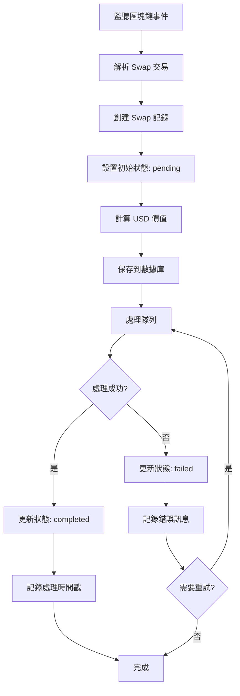

### 檔案規劃用途

database setup for mongodb atlas and schema

- [src/db/models/swap.js => It's going to have every swap with our swaps morails api ](https://docs.moralis.com/web3-data-api/evm/reference/get-swaps-by-wallet-address?address=0xcB1C1FdE09f811B294172696404e88E658659905&chain=eth&order=DESC)
- src/db/models/trackedWallet.js => 追蹤特定錢包地址的交易活動 / 提供易於管理與分類的錢包清單 / 根據錢包狀態自動執行檢查或通知
- src/db/models/chains.js => Chain Schema：用來儲存區塊鏈設定、區塊鏈瀏覽器網址，以及原生代幣資訊
- src/db/index.js => 這個檔案會作為資料庫相關功能的進入點
- src/polling => 指應用程式定期向區塊鏈節點或 API 發送請求，以獲取最新的鏈上資料或狀態更新。例如，開發者會透過 polling 方式，定時查詢某個錢包地址的餘額、交易狀態、NFT 持有情況等資訊
- src/wallet => 初始化 EVM 或 Solana 錢包，例如使用 ethers.js 或 solana web3.js

2. 主要目標

- 唯一且完整地記錄每一筆 Swap 交易
- 支援多鏈、多幣種的兌換資訊
- 方便後續查詢、報表與數據分析
- 支援交易處理狀態追蹤與異常監控

流程說明
用戶發起 Swap 交易
系統收到用戶在特定鏈上的 Swap 交易，取得來源錢包、來源鏈、來源交易雜湊、交易時間等資訊。

記錄 Swap 詳細內容
系統根據 Swap 內容，記錄兌換前後的代幣資訊（合約地址、名稱、符號、數量、小數位數），並計算美元價值。

記錄交易所資訊
若有對應的交易所或流動性池，記錄其名稱、合約地址與交易對地址。

處理狀態管理

初始狀態為 pending

當系統處理完畢，更新 processed、processingTimestamp、ourTxHash 與 status

若處理失敗，status.code 設為 failed，並填寫 message

資料唯一性與查詢優化

以 sourceWallet、sourceChain、sourceTxHash 組合為唯一索引，避免重複

針對 processed、status.code、sourceTimestamp 建立索引，提升查詢效能

## Swap 資料結構

| 欄位名稱                   | 型別    | 必填 | 說明                                                       |
| -------------------------- | ------- | ---- | ---------------------------------------------------------- |
| `sourceWallet`             | String  | ✔️   | 來源錢包地址（用戶發起 Swap 的地址）                       |
| `sourceChain`              | String  | ✔️   | 來源鏈名稱（如 Ethereum、BSC 等）                          |
| `sourceTxHash`             | String  | ✔️   | 來源鏈上的交易雜湊，唯一標識一筆 Swap                      |
| `sourceTimestamp`          | Date    | ✔️   | 來源鏈交易發生的時間                                       |
| `tokenIn.address`          | String  | ✔️   | 兌換前代幣的合約地址                                       |
| `tokenIn.symbol`           | String  | ✔️   | 兌換前代幣的符號                                           |
| `tokenIn.name`             | String  | ✔️   | 兌換前代幣的名稱                                           |
| `tokenIn.amount`           | String  | ✔️   | 兌換前代幣的數量（字串型態，避免精度誤差）                 |
| `tokenIn.decimals`         | Number  | ✔️   | 兌換前代幣的小數位數                                       |
| `tokenOut.address`         | String  | ✔️   | 兌換後代幣的合約地址                                       |
| `tokenOut.symbol`          | String  | ✔️   | 兌換後代幣的符號                                           |
| `tokenOut.name`            | String  | ✔️   | 兌換後代幣的名稱                                           |
| `tokenOut.amount`          | String  | ✔️   | 兌換後代幣的數量（字串型態，避免精度誤差）                 |
| `tokenOut.decimals`        | Number  | ✔️   | 兌換後代幣的小數位數                                       |
| `usdValue`                 | Number  | ✔️   | 本次 Swap 的美元價值（用於報表與統計）                     |
| `exchangeInfo.name`        | String  |      | 交易所或流動性池名稱（如 Uniswap V3）                      |
| `exchangeInfo.address`     | String  |      | 交易所合約地址                                             |
| `exchangeInfo.pairAddress` | String  |      | 交易對合約地址                                             |
| `processed`                | Boolean |      | 是否已處理（預設 false）                                   |
| `processingTimestamp`      | Date    |      | 系統處理該筆 Swap 的時間                                   |
| `ourTxHash`                | String  |      | 系統執行 Swap 時產生的交易雜湊                             |
| `status.code`              | String  |      | 處理狀態（pending, completed, failed, skipped, submitted） |
| `status.message`           | String  |      | 狀態說明訊息                                               |
| `createdAt`                | Date    |      | 建立時間（自動產生）                                       |
| `updatedAt`                | Date    |      | 最後更新時間（自動產生）                                   |

### 資源參考

#### 官方技術文件與 API 參考手冊

- [Moralis 是一個提供跨鏈 API、用戶認證、數據聚合、雲端函數和即時區塊鏈事件監控等功能，幫助開發者快速建構和部署區塊鏈應用的 Web3 後端服務平台。](https://docs.moralis.com/)

#### 針對開發者的產品介紹、應用場景與整合資源入口

- [提供豐富的區塊鏈數據，包括 NFT、ERC20 代幣、DeFi 協議、交易歷史等。並可一鍵接入多條主流公鏈（如 Ethereum、BNB、Polygon、Avalanche、Fantom 等）。支援即時與歷史價格、完整錢包組合數據、解碼後的 DeFi 資產等](https://developers.moralis.com/)

#### 跨多條公鏈自動比價、最佳路徑的代幣兌換聚合 AP

- [1inch Swap API 的用途是讓開發者在各大區塊鏈（如以太坊、BNB 鏈、Polygon 等）上，透過路由和聚合算法，實現用戶自托管錢包之間的代幣閃兌，並自動尋找最佳價格和路徑，方便整合到錢包、dApp 或交易平台中](https://portal.1inch.dev/documentation/apis/swap/classic-swap/quick-start)

#### Solana 上一站式聚合流動性、閃兌與交易保護的高效 API

- [Jupiter Ultra API 的用途是讓開發者在 Solana 上聚合多個流動性來源，實現用戶代幣閃兌、查詢最佳價格、獲取賬戶餘額、估算滑點、保護用戶免於 MEV 攻擊，並簡化交易簽名與執行流程，無需自己處理 RPC、手續費或交易廣播等底層細節。](https://dev.jup.ag/docs/ultra-api/)

#### 專案用到的套件與版本

| 套件名稱              | 版本    | 說明                                                                                                                 |
| --------------------- | ------- | -------------------------------------------------------------------------------------------------------------------- |
| @solana/web3.js       | ^1.98.2 | 2025/05/28 版本一致                                                                                                  |
| axios                 | ^1.9.0  | 2025/05/28 版本一致                                                                                                  |
| base-58               | ^0.0.1  | 11 年未更新，功能單純，僅適用於非常基本需求，之後應該會改成 bs58 > 6.0.0 穩定、主流，廣泛用於加密貨幣與區塊鏈專案    |
| dotenv                | ^16.5.0 | 2025/05/28 版本一致                                                                                                  |
| ethers                | 5.0.0   | 先不升級，v5 適合需要維護舊專案或依賴大量社群現有教學的情境。 v6 適合新專案，享受更現代化語法、更簡潔 API 和更好效能 |
| mongodb               | ^6.16.0 | 25/05/28 最新版是 6.16.0                                                                                             |
| mongoose              | ^8.15.1 | 25/05/28 最新版本為 8.15.1                                                                                           |
| node-telegram-bot-api | ^0.65.1 | 25/05/28 最新版本為 0.66.1                                                                                           |
| nodemon               | ^3.1.10 | 25/05/28 最新版本為 3.1.10                                                                                           |

                                                                                                           |

#### ethers.js v5 與 v6 主要差異比較

| 特性/寫法           | ethers v5                          | ethers v6                                 |
| ------------------- | ---------------------------------- | ----------------------------------------- |
| 數字處理            | 使用自有 BigNumber 類              | 改用原生 ES2020 BigInt                    |
| Provider 實例       | `ethers.providers.JsonRpcProvider` | `ethers.JsonRpcProvider`                  |
| Web3Provider 命名   | `Web3Provider`                     | 改名為 `BrowserProvider`                  |
| 合約方法調用        | 需處理方法簽名衝突                 | 用 Proxy 動態解析，Typed API 更簡潔       |
| 方法定義            | 方法分在 buckets                   | 每個方法直接掛載 less-common 操作         |
| 導入方式            | 多子包、monorepo                   | 所有 API 集中在主包，pkg.exports 支援細分 |
| 交易手續費          | 多個 fee 參數                      | 統一為 `.getFeeData()`                    |
| Transaction helpers | 分散多處                           | 集中於 `Transaction` 類                   |

##### ethers.js v5 與 v6 主要差異比較實際代碼範例

```

// v5 寫法：
import { ethers } from 'ethers';
const provider = new ethers.providers.JsonRpcProvider(url);
const contract = new ethers.Contract(address, abi, provider);

```

```

// v6 寫法：
import { ethers } from 'ethers';
const provider = new ethers.JsonRpcProvider(url);
const contract = new ethers.Contract(address, abi, provider);

```

```

BigNumber 與 BigInt 差異：
v5: ethers.BigNumber.from('1000000000000000000')
v6: 12345678901234567890n（直接用 JS 的 BigInt）

```


