# 🌌 Codebase

> 主要基於 ES6 (ES2015) 和 ES2017 語法規範，但採用 Node.js 的 CommonJS 模組載入方式，屬於典型的後端 JavaScript 開發寫法。若要明確指定版本，可視為 ES2017+ 的實踐。
> 箭頭函數與 async/await 語法、const 與解構賦值、模板字符串(process.env.ETH_RPC_URL || "")，未使用 ES2020+ 新特性如 optional chaining (?.) 或 nullish coalescing (??)，
> 且 node 18.20.4 版本下載相關套件，雖然 node 14 以上就能用 ES2020+ 的寫法，但此專案還是以 ES2017+方式撰寫。當然日後用 ES2020+ 新特性去實作也不影響就是了。

- src/script => populate our database with all the basic config
- src/db/models/trackedWallet.js => 追蹤特定錢包地址的交易活動 / 提供易於管理與分類的錢包清單 / 根據錢包狀態自動執行檢查或通知
- src/db/models/chains.js => Chain Schema：用來儲存區塊鏈設定、區塊鏈瀏覽器網址，以及原生代幣資訊
- src/db/index.js => 這個檔案會作為資料庫相關功能的進入點
- src/polling => 指應用程式定期向區塊鏈節點或 API 發送請求，以獲取最新的鏈上資料或狀態更新。例如，開發者會透過 polling 方式，定時查詢某個錢包地址的餘額、交易狀態、NFT 持有情況等資訊
- src/wallet => 初始化 EVM 或 Solana 錢包，例如使用 ethers.js 或 solana web3.js

## Swap 業務需求

### 主要目標

- 唯一且完整地記錄每一筆 Swap 交易
- 支援多鏈、多幣種的兌換資訊
- 方便後續查詢、報表與數據分析
- 支援交易處理狀態追蹤與異常監控

- [src/db/models/swap.js => 整合 Swap 功能，並透過 Swaps Moralis API 實現](https://docs.moralis.com/web3-data-api/evm/reference/get-swaps-by-wallet-address?address=0xcB1C1FdE09f811B294172696404e88E658659905&chain=eth&order=DESC)

```mermaid
flowchart TD
    A["監聽區塊鏈事件"] --> B["解析 Swap 交易"]
    B --> C["創建 Swap 記錄"]
    C --> D["設置初始狀態: pending"]
    D --> E["計算 USD 價值"]
    E --> F["保存到數據庫"]
    F --> G["處理隊列"]
    G --> H{"處理成功?"}
    H -->|是| I["更新狀態: completed"]
    H -->|否| J["更新狀態: failed"]
    I --> K["記錄處理時間戳"]
    J --> L["記錄錯誤訊息"]
    K --> M["完成"]
    L --> N{"需要重試?"}
    N -->|是| G
    N -->|否| M
```



## 資源參考

#### 官方技術文件與 API 參考手冊

- [Moralis 是一個提供跨鏈 API、用戶認證、數據聚合、雲端函數和即時區塊鏈事件監控等功能，幫助開發者快速建構和部署區塊鏈應用的 Web3 後端服務平台。](https://docs.moralis.com/)

#### 針對開發者的產品介紹、應用場景與整合資源入口

- [提供豐富的區塊鏈數據，包括 NFT、ERC20 代幣、DeFi 協議、交易歷史等。並可一鍵接入多條主流公鏈（如 Ethereum、BNB、Polygon、Avalanche、Fantom 等）。支援即時與歷史價格、完整錢包組合數據、解碼後的 DeFi 資產等](https://developers.moralis.com/)

#### 跨多條公鏈自動比價、最佳路徑的代幣兌換聚合 AP

- [1inch Swap API 的用途是讓開發者在各大區塊鏈（如以太坊、BNB 鏈、Polygon 等）上，透過路由和聚合算法，實現用戶自托管錢包之間的代幣閃兌，並自動尋找最佳價格和路徑，方便整合到錢包、dApp 或交易平台中](https://portal.1inch.dev/documentation/apis/swap/classic-swap/quick-start)

#### Solana 上一站式聚合流動性、閃兌與交易保護的高效 API

- [Jupiter Ultra API 的用途是讓開發者在 Solana 上聚合多個流動性來源，實現用戶代幣閃兌、查詢最佳價格、獲取賬戶餘額、估算滑點、保護用戶免於 MEV 攻擊，並簡化交易簽名與執行流程，無需自己處理 RPC、手續費或交易廣播等底層細節。](https://dev.jup.ag/docs/ultra-api/)

#### 專案用到的套件與版本

| 套件名稱              | 版本    | 說明                                                                                                                 |
| --------------------- | ------- | -------------------------------------------------------------------------------------------------------------------- |
| @solana/web3.js       | ^1.98.2 | 2025/05/28 版本一致                                                                                                  |
| axios                 | ^1.9.0  | 2025/05/28 版本一致                                                                                                  |
| base-58               | ^0.0.1  | 11 年未更新，功能單純，僅適用於非常基本需求，之後應該會改成 bs58 > 6.0.0 穩定、主流，廣泛用於加密貨幣與區塊鏈專案    |
| dotenv                | ^16.5.0 | 2025/05/28 版本一致                                                                                                  |
| ethers                | 5.0.0   | 先不升級，v5 適合需要維護舊專案或依賴大量社群現有教學的情境。 v6 適合新專案，享受更現代化語法、更簡潔 API 和更好效能 |
| mongodb               | ^6.16.0 | 25/05/28 最新版是 6.16.0                                                                                             |
| mongoose              | ^8.15.1 | 25/05/28 最新版本為 8.15.1                                                                                           |
| node-telegram-bot-api | ^0.65.1 | 25/05/28 最新版本為 0.66.1                                                                                           |
| nodemon               | ^3.1.10 | 25/05/28 最新版本為 3.1.10                                                                                           |

                                                                                                           |

#### ethers.js v5 與 v6 主要差異比較

| 特性/寫法           | ethers v5                          | ethers v6                                 |
| ------------------- | ---------------------------------- | ----------------------------------------- |
| 數字處理            | 使用自有 BigNumber 類              | 改用原生 ES2020 BigInt                    |
| Provider 實例       | `ethers.providers.JsonRpcProvider` | `ethers.JsonRpcProvider`                  |
| Web3Provider 命名   | `Web3Provider`                     | 改名為 `BrowserProvider`                  |
| 合約方法調用        | 需處理方法簽名衝突                 | 用 Proxy 動態解析，Typed API 更簡潔       |
| 方法定義            | 方法分在 buckets                   | 每個方法直接掛載 less-common 操作         |
| 導入方式            | 多子包、monorepo                   | 所有 API 集中在主包，pkg.exports 支援細分 |
| 交易手續費          | 多個 fee 參數                      | 統一為 `.getFeeData()`                    |
| Transaction helpers | 分散多處                           | 集中於 `Transaction` 類                   |

##### ethers.js v5 與 v6 主要差異比較實際代碼範例

```

// v5 寫法：
import { ethers } from 'ethers';
const provider = new ethers.providers.JsonRpcProvider(url);
const contract = new ethers.Contract(address, abi, provider);

```

```

// v6 寫法：
import { ethers } from 'ethers';
const provider = new ethers.JsonRpcProvider(url);
const contract = new ethers.Contract(address, abi, provider);

```

```

BigNumber 與 BigInt 差異：
v5: ethers.BigNumber.from('1000000000000000000')
v6: 12345678901234567890n（直接用 JS 的 BigInt）

```
